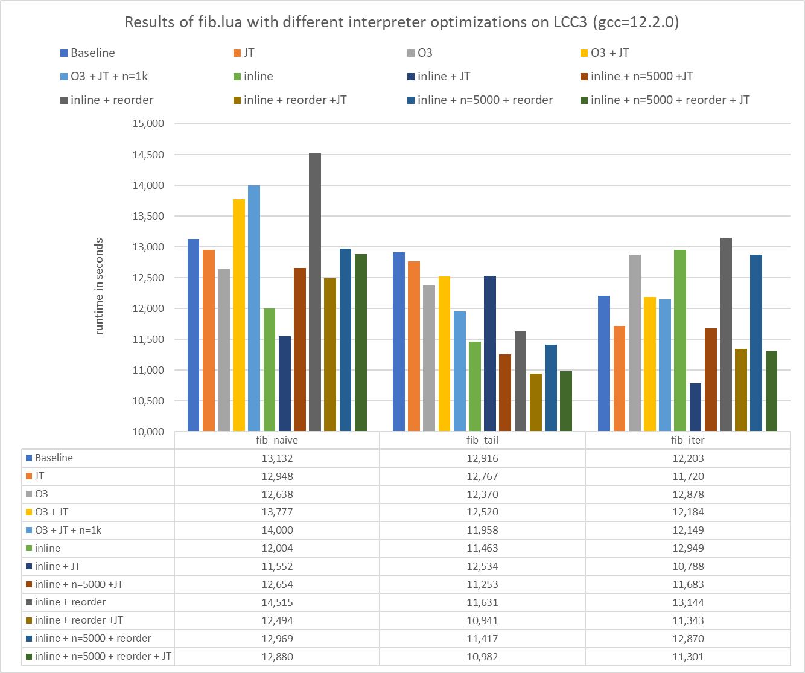

# Sheet 12

## A) Setup and Basic Execution
Goal of this task was to download and build lua and execute the `fib.lua` benchmark.
- Get the latest lua version 
- `wget https://github.com/PeterTh/perf-oriented-dev/blob/master/lua/fib.lua`
- Build lua using `make all test`
- Execute the benchmark

```bash
100 x fibonacci_naive(30)     time:  18.2945 s  --  832040
10000000 x fibonacci_tail(30) time:  17.2246 s  --  832040
25000000 x fibonacci_iter(30) time:  14.9098 s  --  832040		
```


## B) Profiling
To enable Profiling with gprof or perf we must first compile the program with some specific flags. In the `src/Makefile` add the following options to `MYCFLAGS` and `MYLDFLAGS `

### gprof

```Make
# for gprof
MYCFLAGS= -pg
MYLDFLAGS= -pg
```

Simply run the `./lua "path/to/fib.lua"` command via sbatch to generate the `gmon.out` file.
After that we can generate a report via `gprof ./lua gmon.out > analysis.txt`

```
Flat profile:

Each sample counts as 0.01 seconds.
  %   cumulative   self              self     total           
 time   seconds   seconds    calls   s/call   s/call  name    
 76.56     12.28    12.28        1    12.28    14.98  luaV_execute
 10.16     13.91     1.63 310000031     0.00     0.00  luaD_pretailcall
  6.23     14.91     1.00 306946270     0.00     0.00  luaD_precall
  3.06     15.40     0.49 271946189     0.00     0.00  luaH_getshortstr
  0.90     15.55     0.15 35000103     0.00     0.00  luaT_getvarargs
  0.44     15.62     0.07 25000004     0.00     0.00  forprep
  0.34     15.67     0.06 25000004     0.00     0.00  luaV_tointeger
  0.31     15.72     0.05 10000002     0.00     0.00  luaF_closeupval
  0.31     15.77     0.05 10000001     0.00     0.00  luaF_findupval
  ...
```


### perf
```Make
# for perf
MYCFLAGS= -p
MYLDFLAGS= -p
```

To profile the program simply run `perf record ./lua "path/to/fib.lua"`. After the job is complete we can generate the report with `perf report`


```perf
Samples: 147K of event 'cycles:u', Event count (approx.):
Overhead  Command  Shared Object     Symbol
  76.41%  lua      lua               [.] luaV_execute   
   8.81%  lua      lua               [.] luaD_pretailcal
   4.95%  lua      lua               [.] luaH_getshortst
   4.83%  lua      lua               [.] luaD_precall   
   0.88%  lua      lua               [.] forprep        
   0.61%  lua      libc-2.28.so      [.] _int_free      
   0.53%  lua      lua               [.] freeobj        
   0.41%  lua      lua               [.] luaT_getvarargs
   0.35%  lua      libc-2.28.so      [.] malloc         
   0.24%  lua      lua               [.] luaM_free_     
   0.23%  lua      libc-2.28.so      [.] _int_malloc    
   0.19%  lua      libc-2.28.so      [.] realloc 
```

### Results

Both profilers were able to identitfy the hotspots in the LUA interpreter. `luaV_execute` takes up most of the execution time and is responsibly for calling the `luaD_pretailcall` and `luaD_precall` functions, which are called the most as well as `luaH_getshortst`. Optimizing these functions for our `fib.lua` program will yield the greatest improvement.

## C) Code Understanding

### Lua execution process
The lua exection process involves the following steps:
- Lexical Analysis: The source code is broken down into tokens.
- Syntactic Analysis (Parsing): Tokens are parsed into an abstract syntax tree (AST).
- Semantic Analysis: The AST is analyzed to ensure semantic correctness.
- Bytecode Generation: The AST is compiled into Lua bytecode.
- Execution: The Lua virtual machine executes the bytecode.

The execution time of the first 4 steps can be measured by adjusting the `handle_script` function in `lua.c`:
```C
static int handle_script (lua_State *L, char **argv) {
	int status;
	const char *fname = argv[0];
	if (strcmp(fname, "-") == 0 && strcmp(argv[-1], "--") != 0)
	fname = NULL;  /* stdin */
	
	clock_t start_compile = clock();
	status = luaL_loadfile(L, fname);
	clock_t end_compile = clock();
	
	double compile_time = (double)(end_compile - start_compile) / CLOCKS_PER_SEC;
	printf("Compile time: %f seconds\n", compile_time);
	
	if (status == LUA_OK) {
		int n = pushargs(L);  /* push arguments to script */
		status = docall(L, n, LUA_MULTRET);
	}
	return report(L, status);
}
```

The execution time of the step 5 can be measured by adjusting the `docall` function in `lua.c`:

```C
static int docall (lua_State *L, int narg, int nres) {
	int status;
	int base = lua_gettop(L) - narg;  /* function index */
	lua_pushcfunction(L, msghandler);  /* push message handler */
	lua_insert(L, base);  /* put it under function and args */
	globalL = L;  /* to be available to 'laction' */
	setsignal(SIGINT, laction);  /* set C-signal handler */
	
	clock_t start_exec = clock();
	status = lua_pcall(L, narg, nres, base);
	clock_t end_exec = clock();
	
	double exec_time = (double)(end_exec - start_exec) / CLOCKS_PER_SEC;
	printf("Execution time: %f seconds\n", exec_time);
	
	setsignal(SIGINT, SIG_DFL); /* reset C-signal handler */
	lua_remove(L, base);  /* remove message handler from the stack */
	return status;
}
```


We can see that the whole analysis and compilation process takes way less time than the execution of the actual function:
```bash
Compile time: 0.000064 seconds
100 x fibonacci_naive(30)     time:  18.2945 s  --  832040
10000000 x fibonacci_tail(30) time:  17.2246 s  --  832040
25000000 x fibonacci_iter(30) time:  14.9098 s  --  832040	
Execution time: 50.428908 seconds
```
### LUA_USE_JUMPTABLE

The LUA_USE_JUMPTABLE option is a compilation flag used in the Lua interpreter to improve the performance of the virtual machine by using a jump table instead of a switch statement for the main loop of the VM.

- LUA_USE_JUMPTABLE = false: The interpreter uses a switch-case statement to dispatch bytecode instructions.
- LUA_USE_JUMPTABLE = true: The interpreter uses a direct threading technique, where each opcode directly jumps to the corresponding handler, reducing the overhead of branch prediction and making instruction dispatch faster.

For execution time comparison, the lua interpreter is compiled twice. The results show that using a jumptable is slightly faster, but the difference is not very significant, at least for this benchmark.

```bash
# LUA_USE_JUMPTABLE = flase
100 x fibonacci_naive(30)     time:  18.2835 s  --  832040
10000000 x fibonacci_tail(30) time:  17.2264 s  --  832040
25000000 x fibonacci_iter(30) time:  14.9101 s  --  832040	
```

```bash
# LUA_USE_JUMPTABLE = true
100 x fibonacci_naive(30)     time:  18.0832 s  --  832040
10000000 x fibonacci_tail(30) time:  17.0894 s  --  832040
25000000 x fibonacci_iter(30) time:  14.8177 s  --  832040
```

## D) Optimization

All builds were compiled with `gcc 12.2.0`. When benchmarking it is important to remove the profiling flags from the compiler, as these tend to increase the runtime by alot. 

As seen in task B) the main goal is to decrease the runtime of `luaV_execute`, which is the main loop of the LUA interpreter. We will start with simple compiler optimizations and see if we can gain any performance without manipulating the source code first. After that the main goal is to reduce the overhead of calling `luaD_pretailcall` and `luad_precall` by inlining them. It would also be ideal if we could make any optimizations to the main loop of `luaV_excute`.

### Experiments

|                 | Baseline | Jumptable | O3      | O3 + JT | inlining | inline + n=5000 | inline + reorder | inline + n=5000 + reorder |
| --------------- | -------- | --------- | ------- | ------- | -------- | --------------- | ---------------- | ------------------------- |
| fibonacci_naive | 12.4563  | 12.8738   | 13.7820 | 13.7769 | 11.5519  | 12.6538         | 12.4942          | 12.8798                   |
| fibonacci_tail  | 12.6122  | 12.5915   | 12.6314 | 12.5204 | 12.5336  | 11.2528         | 10.9410          | 10.9821                   |
| fibonacci_iter  | 10.8823  | 10.8881   | 12.1682 | 12.1839 | 10.7880  | 11.6832         | 11.3429          | 11.3013                   |


- Jumptable: Add `-DLUA_USE_JUMPTABLE=1` to `MYCFLAGS` in `src/Makefile`
- O3: Replace O2 with O3 in `src/Makefile`
- inline: replace `LUAI_FUNC` with `static inline` in the function signatures of `luaD_pretailcall`,`luaD_precall` to reduce the overhead of calling these functions. Move declaration and dependencies of those functions to the ldo.h file.
  - `#include "lapi.h"`
  - `#include "lgc.h"`
  - `#define next_ci(L)  (L->ci->next ? L->ci->next : luaE_extendCI(L))`
  - `prepCallInfo`
  - `precallC`
  -  Also don't forget to add `-finline-functions` to your makefile. We can also increase the size of inlined functions with `-finline-limit=n`
- reorder: Reordering the vmcases such that `OP_CALL` and `OP_TAILCALL` are at the beginning of the `vmdispatch` statement

### Results

The thing that definetly helped most was inlining the most called functions. Using O3 seemed to decrease performance, so the inlining of functions had to be enabled by setting the specific compiler flag manually. Also, reordering the vmcases had a noticable effect for `fibonacci_tail` and `fibonacci_iter`.   
As for inlining, keeping the `-finline-limit` at it's default value (600) didn't inline the big functions as expected so we set it to 1000 which seemed to be the sweetspot, as larger numbers (5000) increased the runtime. Sadly the use of jumptables did not really do anything, and for later benchmarks it also seemed increase the runtime by a bit.

Also as a sidenote: Using these optimizations on a local machine running WSL, the performance increase was much more noticable (~20%) compared to LCC3 where the improvements where mostly in the single digits. The main improvement on local hardware came from the use of O3.


